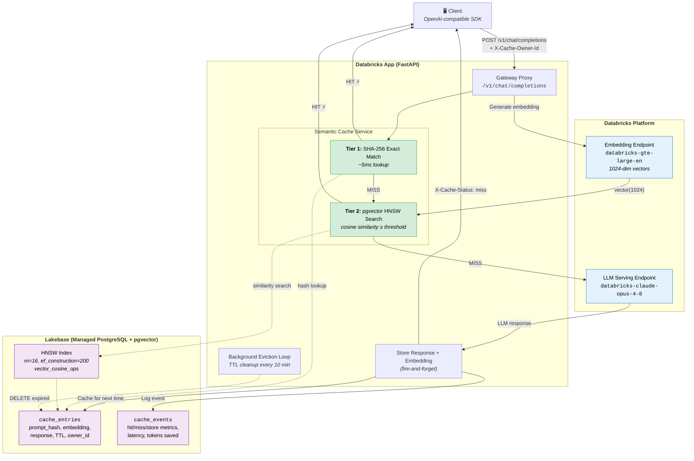

# Semantic Cache Gateway Proxy

An OpenAI-compatible LLM proxy with **semantic caching** — identical or semantically similar prompts return cached responses instantly, saving cost and latency. Built on Databricks Lakebase (managed PostgreSQL + pgvector).

## Why Use This?

- **Drop-in replacement** — swap your LLM endpoint URL and get caching for free
- **Two-tier cache** — exact hash match (~5ms) + vector similarity search for paraphrased questions
- **Cost savings** — cache hits avoid LLM calls entirely (tokens saved tracked in metrics)
- **Multi-tenant** — isolate cache per user/team via a single header

## How It Works

```
Client → POST /v1/chat/completions
            │
            ├─ Tier 1: SHA-256 exact match (< 5ms)
            │     └─ HIT → return cached response
            │
            ├─ Tier 2: Embedding → pgvector HNSW cosine similarity
            │     └─ similarity ≥ threshold → HIT
            │
            └─ MISS → forward to LLM → cache response → return
```

Responses include `X-Cache-Status: hit|miss` and `X-Cache-Similarity` headers.

## Quick Start

### Prerequisites

- Databricks workspace with Apps enabled
- Databricks CLI/SDK authenticated (`~/.databrickscfg` or env vars)
- Python 3.10+

### One-Command Deploy

```bash
git clone https://github.com/AnanyaDBJ/semantic_cache.git
cd semantic_cache
pip install -r requirements.txt

python setup_cache.py my-semantic-cache
```

This single command:
1. Creates a Lakebase autoscale PostgreSQL instance
2. Sets up the schema (tables, HNSW vector index, permissions)
3. Updates config files with your instance details
4. Uploads source code to your Databricks workspace
5. Creates and deploys the app

**Options:**
```
python setup_cache.py <instance-name> [options]

  --app-name NAME         App name (max 30 chars, defaults to instance name)
  --embedding-model NAME  Embedding endpoint (default: databricks-gte-large-en)
  --llm-model NAME        LLM endpoint (default: databricks-claude-opus-4-6)
  --skip-lakebase-create  Skip instance creation if it already exists
  --skip-schema           Skip DDL if schema is already set up
  --skip-deploy           Only update config files locally
```

### Use It

Once deployed, point any OpenAI-compatible client at your app URL:

```python
from openai import OpenAI

client = OpenAI(
    base_url="https://<your-app>.aws.databricksapps.com/v1",
    api_key="<your-databricks-token>",
)

response = client.chat.completions.create(
    model="databricks-claude-opus-4-6",
    messages=[{"role": "user", "content": "What is Databricks?"}],
    temperature=0,
)
# First call: X-Cache-Status: miss (calls LLM)
# Second call: X-Cache-Status: hit (instant, no LLM cost)
```

### Headers

| Header | Purpose |
|--------|---------|
| `X-Cache-Status` | Response: `hit` or `miss` |
| `X-Cache-Similarity` | Response: cosine similarity score (on semantic hits) |
| `X-Cache-Owner-Id` | Request: isolate cache per tenant (default: `global`) |
| `X-Cache-Bypass` | Request: set to `true` to skip cache |

### Cache Behavior

Caching is **skipped** when:
- `temperature > 0` (non-deterministic responses shouldn't be cached)
- `stream: true` (streaming not supported for caching)
- `X-Cache-Bypass: true` header is set

## API Endpoints

| Endpoint | Method | Description |
|----------|--------|-------------|
| `/v1/chat/completions` | POST | OpenAI-compatible chat (with caching) |
| `/health` | GET | Health check (DB connectivity) |
| `/v1/cache/stats` | GET | Cache hit rate, latency, tokens saved |
| `/v1/cache/clear` | DELETE | Clear cache entries for an owner |

## Architecture



### Request Flow Summary

| Step | Action | Latency |
|------|--------|---------|
| 1 | Client sends chat completion request | — |
| 2 | Normalize context → SHA-256 hash | <1ms |
| 3 | **Tier 1:** Exact hash lookup in PostgreSQL | ~5ms |
| 4 | **Tier 2:** Generate embedding → HNSW cosine search | ~50-100ms |
| 5 | **Miss:** Forward to LLM, cache response | ~1-30s |
| 6 | Return response with `X-Cache-Status` header | — |

## Configuration

All settings in `config.py` are overridable via environment variables:

| Setting | Default | Description |
|---------|---------|-------------|
| `SIMILARITY_THRESHOLD` | 0.92 (prod) | Min cosine similarity for a semantic hit |
| `DEFAULT_TTL_SECONDS` | 86400 | Cache entry lifetime (24h) |
| `MAX_CONTEXT_TURNS` | 5 | Conversation turns included in cache key |
| `EMBEDDING_MODEL` | databricks-gte-large-en | Embedding endpoint name |
| `DEFAULT_LLM_MODEL` | databricks-claude-opus-4-6 | Default LLM for forwarded requests |

## Project Structure

```
├── setup_cache.py          # One-command automated deployment
├── app.py                  # FastAPI application + endpoints
├── app.yaml                # Databricks App manifest
├── config.py               # Settings (pydantic-settings, env var override)
├── requirements.txt
├── cache/
│   ├── semantic_cache.py   # Two-tier cache logic (hash + HNSW)
│   ├── embedding.py        # Databricks embedding client
│   └── models.py           # Pydantic request/response models
├── db/
│   ├── connection.py       # Async connection pool with OAuth token refresh
│   └── schema.py           # Schema verification at startup
├── gateway/
│   └── llm_client.py       # LLM forwarding with retry/backoff
└── middleware/
    └── observability.py    # Request latency + cache status logging
```

## Local Development

```bash
pip install -r requirements.txt
uvicorn app:app --host 0.0.0.0 --port 8000 --reload
```

Requires Databricks SDK authentication and a running Lakebase instance with the schema already set up (use `python setup_cache.py <name> --skip-deploy`).

## License

Internal use.
